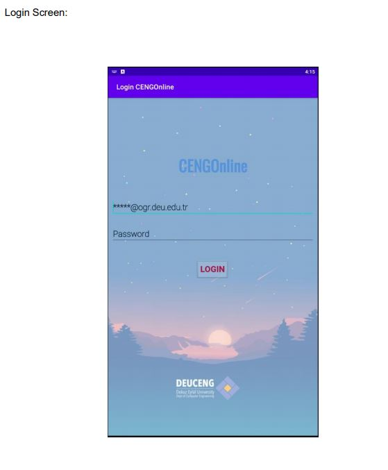
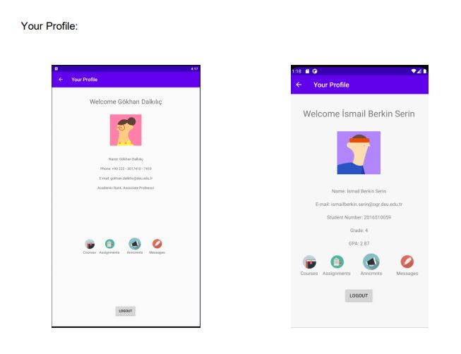
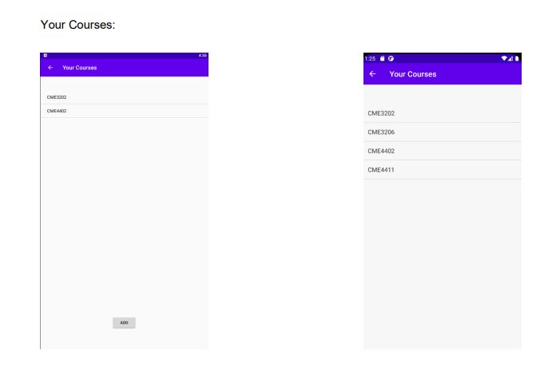
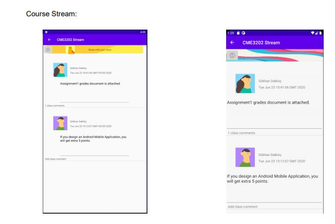
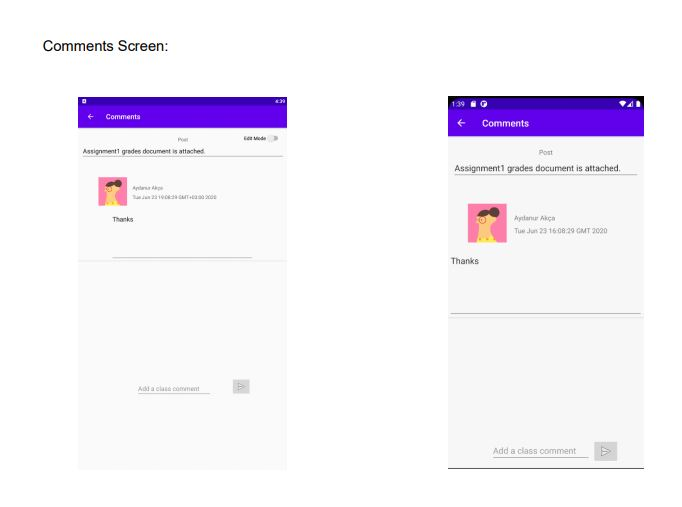

# CengOnline
Android Project with Firebase

Android project implemented in Java programming language containing OOP principles. Firebase Firestore is used for data repository purposes.

The main goal for this project is to build a medium like Google Classroom for teachers and students.

Screenshots from the application:

